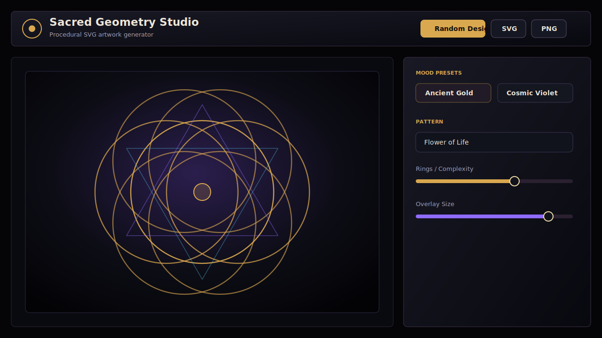

# Sacred Geometry Studio

Sacred Geometry Studio is a polished dark-mode creative tool for generating procedural sacred geometry artwork directly in the browser. It is built as a focused creative studio: live SVG preview, curated visual presets, deterministic randomization, layered geometry, animation controls, and export-ready artwork without accounts, backend services, or external AI APIs.

**Live demo:** [ddave82.github.io/sacred-geometry-studio](https://ddave82.github.io/sacred-geometry-studio/)



## What It Does

Sacred Geometry Studio turns procedural geometry into exportable artwork. Choose a pattern, tune the structure, layer a secondary overlay, shape the background, add motion, and export the result as SVG, high-resolution PNG, or browser-rendered video.

The interface is intentionally dark, calm, and studio-like so the artwork stays visually dominant. Presets such as Ancient Gold, Cosmic Violet, Deep Space, Black Paper, and Copper Engraving are designed to look strong immediately while still being fully editable.

## Highlights

- Procedural SVG renderer with no static pattern images
- Dark premium creative-studio interface
- Live preview that updates instantly
- Main geometry layer plus secondary overlay and center symbol layer
- Mood presets with curated palettes and background styles
- Deterministic random designs from a reusable seed
- Compact motion system with animated preview
- Local preset save, load, and delete via `localStorage`
- SVG export
- PNG export at `1024`, `2048`, and `4096` px
- Video export via browser `MediaRecorder` with WebM support and MP4 where the browser allows it
- Aspect ratios for square, portrait, landscape, and A4-style output
- Fully client-side: no backend, login, database, or API keys

## Included Patterns

- Flower of Life
- Seed of Life
- Metatron's Cube
- Vesica Piscis
- Sri Yantra inspired geometry
- Radial Mandala
- Star Polygon Grid

## Creative Controls

The editor exposes practical controls for producing finished artwork rather than technical demos:

- Pattern type
- Rings / complexity
- Radius / scale
- Rotation
- Stroke width, color, opacity, and glow
- Secondary color
- Fill and fill opacity
- Center emphasis
- Pattern-specific symmetry controls
- Independent overlay pattern, size, complexity, symmetry, rotation, and opacity
- Background presets, colors, vignette, and subtle grain
- Animation preset, duration, FPS, motion strength, preview toggle, and video format

Controls that do not apply to a selected pattern are disabled instead of pretending to change the geometry. For example, Metatron's Cube has fixed six-fold symmetry, while Radial Mandala and Star Grid expose free symmetry control.

## Presets

Built-in mood presets are tuned to create export-worthy starting points:

- Ancient Gold
- Cosmic Violet
- Monk Ink
- Solar Flare
- Deep Space
- Nordic Frost
- Black Paper
- Psychedelic Aura
- White Marble
- Copper Engraving

## Tech Stack

- [Vite](https://vite.dev/)
- Vanilla JavaScript modules
- SVG rendering
- Canvas for PNG and video rendering
- Browser `MediaRecorder` for video export
- CSS-only dark interface
- `localStorage` for saved presets

## Run Locally

```bash
npm install
npm run dev
```

Then open the local URL printed by Vite, usually:

```text
http://127.0.0.1:5173/
```

If that port is busy, Vite will choose the next available port.

## Build

```bash
npm run build
```

The production files are written to `dist/`.

## GitHub Pages

This repository is configured for GitHub Pages at:

[https://ddave82.github.io/sacred-geometry-studio/](https://ddave82.github.io/sacred-geometry-studio/)

The included workflow builds the Vite app and deploys `dist/` to GitHub Pages whenever `main` is pushed.

## Project Structure

```text
src/
  geometry/
    patterns.js      Procedural pattern generation
  animation.js       Motion presets and video MIME support
  export.js          SVG, PNG, and video export
  main.js            UI bindings and live updates
  presets.js         Mood presets and seeded randomizer
  renderer.js        SVG document rendering
  state.js           App state, validation, pattern metadata
  storage.js         localStorage preset persistence
  styles.css         Dark creative-studio UI
```

## Status

The current build is a browser-only creative tool for still artwork and lightweight motion export. WebM is the most reliable video target; MP4 is used when the active browser exposes MP4 recording through `MediaRecorder`. MOV export is not included because browsers do not provide a practical native MOV encoder, and adding one would require a much heavier ffmpeg/WASM pipeline.
