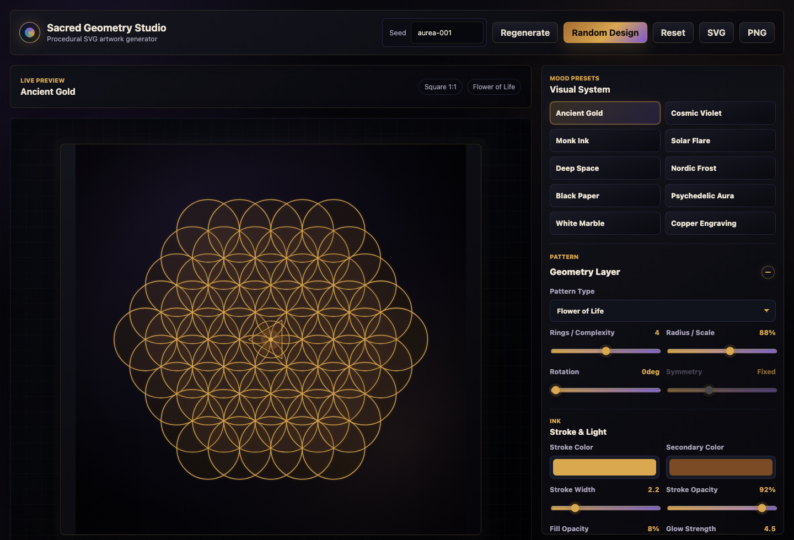

# Sacred Geometry Studio

Sacred Geometry Studio is a polished dark-mode creative tool for generating procedural sacred geometry artwork directly in the browser. It is built as a focused creative studio: live SVG preview, curated visual presets, deterministic randomization, layered geometry, collapsible control panels, animation controls, and export-ready artwork without accounts, backend services, or external AI APIs.

**Live demo:** [ddave82.github.io/sacred-geometry-studio](https://ddave82.github.io/sacred-geometry-studio/)



## What It Does

Sacred Geometry Studio turns procedural geometry into exportable artwork. Choose a pattern, tune the structure, layer a secondary overlay, shape the background, add motion, and export the result as SVG, high-resolution PNG, or browser-rendered video.

The interface is intentionally dark, calm, and studio-like so the artwork stays visually dominant. Presets such as Ancient Gold, Cosmic Violet, Deep Space, Black Paper, and Copper Engraving are designed to look strong immediately while still being fully editable.

## Highlights

- Procedural SVG renderer with no static pattern images
- Dark premium creative-studio interface
- Live preview that updates instantly
- Main geometry layer with integrated stroke, fill, glow, and light controls
- Secondary overlay system with independent pattern, scale, complexity, symmetry, rotation, and opacity
- Optional center symbol layer with motion support
- Mood presets with curated palettes and background styles
- Deterministic random designs from a reusable seed
- Compact motion system with animated preview
- Geometry-aware animation presets that modulate internal radii, points, petals, rings, and lattice structure
- Loop-safe motion math for seamless animation exports
- Adaptive GIF palette export with grain suppression for cleaner color output
- Local preset save, load, and delete via `localStorage`
- Collapsible studio panels for Geometry Layer, Overlay System, Artwork Background, and Animation
- SVG export
- PNG export at `1024`, `2048`, and `4096` px
- Animation export as GIF, WebM, and MP4 where the browser allows native MP4 recording
- Aspect ratios for square, portrait, landscape, and A4-style output
- Fully client-side: no backend, login, database, or API keys

## Included Patterns

- Flower of Life
- Seed of Life
- Metatron's Cube
- Vesica Piscis
- Sri Yantra inspired geometry
- Radial Mandala
- Star Polygon Grid

## Creative Controls

The editor exposes practical controls for producing finished artwork rather than technical demos:

The right-hand studio panel is organized into focused, collapsible sections:

- **Geometry Layer**: pattern type, rings / complexity, radius / scale, rotation, pattern symmetry, stroke color, secondary color, stroke width, stroke opacity, fill opacity, glow, fill toggle, and center emphasis
- **Overlay System**: secondary overlay toggle, overlay pattern, opacity, size, complexity, symmetry, rotation, and center symbol layer
- **Artwork Background**: background preset, two editable background colors, vignette, and subtle grain
- **Animation**: animated preview, motion preset, duration, video FPS, GIF FPS, motion depth, GIF pixel size, and GIF / WebM / MP4 export buttons
- **Output**: aspect ratio and high-resolution PNG size
- **Saved Designs**: local preset save, load, and delete

Controls that do not apply to a selected pattern are disabled instead of pretending to change the geometry. For example, Metatron's Cube has fixed six-fold symmetry, while Radial Mandala and Star Grid expose free symmetry control.

## Presets

Built-in mood presets are tuned to create export-worthy starting points:

- Ancient Gold
- Cosmic Violet
- Monk Ink
- Solar Flare
- Deep Space
- Nordic Frost
- Black Paper
- Psychedelic Aura
- White Marble
- Copper Engraving

## Tech Stack

- [Vite](https://vite.dev/)
- Vanilla JavaScript modules
- SVG rendering
- Canvas for PNG and video rendering
- Browser `MediaRecorder` for WebM and native MP4 export
- Lightweight built-in GIF encoder
- CSS-only dark interface with custom-styled controls and collapsible panels
- `localStorage` for saved presets and panel open / closed state

## Run Locally

```bash
npm install
npm run dev
```

Then open the local URL printed by Vite, usually:

```text
http://127.0.0.1:5173/
```

If that port is busy, Vite will choose the next available port.

## Build

```bash
npm run build
```

The production files are written to `dist/`.

## GitHub Pages

This repository is configured for GitHub Pages at:

[https://ddave82.github.io/sacred-geometry-studio/](https://ddave82.github.io/sacred-geometry-studio/)

The included workflow builds the Vite app and deploys `dist/` to GitHub Pages whenever `main` is pushed.

## Project Structure

```text
src/
  geometry/
    patterns.js      Procedural pattern generation
  animation.js       Motion presets and video MIME support
  export.js          SVG, PNG, GIF, WebM, and MP4 export
  gif.js             Browser-side animated GIF encoder
  main.js            UI bindings and live updates
  presets.js         Mood presets and seeded randomizer
  renderer.js        SVG document rendering
  state.js           App state, validation, pattern metadata
  storage.js         localStorage preset persistence
  styles.css         Dark creative-studio UI
```

## Status

The current build is a browser-only creative tool for still artwork and lightweight motion export. GIF and WebM are the most reliable browser targets. GIF export has its own pixel-size control for the longest edge while preserving the selected aspect ratio. MP4 is used when the active browser exposes MP4 recording through `MediaRecorder`; browsers that do not support native MP4 recording will show that clearly instead of silently saving WebM. MOV export is not included because browsers do not provide a practical native MOV encoder, and adding one would require a much heavier ffmpeg/WASM pipeline.
